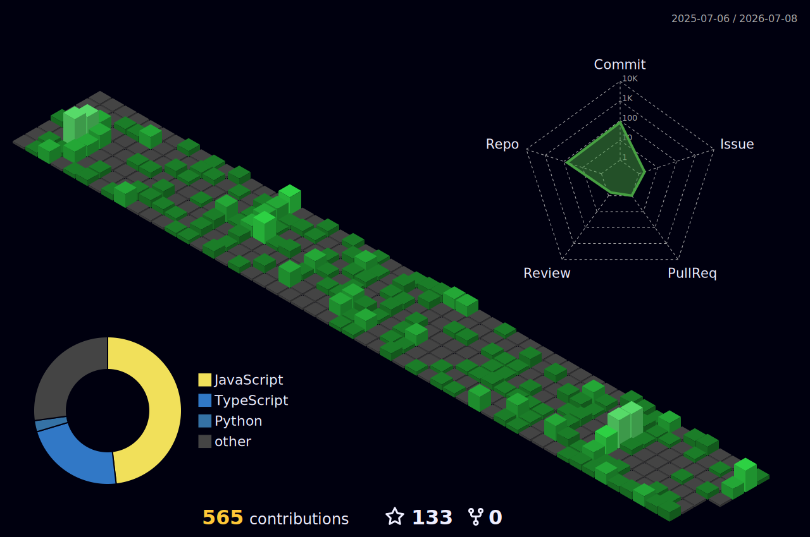
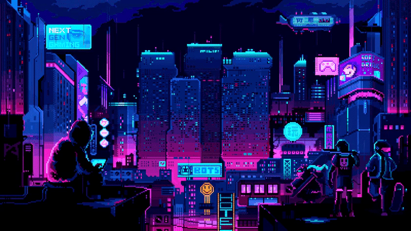
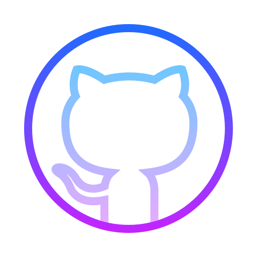

<h2 align="center"> Self-taught, curious, and passionate about coding!</h2>

I'm Raj, a final-year Computer Science student at BIT Mesra focused on full-stack development, scalable backend systems, automation, and machine learning.  - 🔭 I’m working as a Freelance Software Developer, architecting and deploying high-performance web applications, automation systems, and microservices - 📚 I'm currently learning advanced system design, machine learning optimization, and cloud-native technologies - ⚡ In my free time I solve competitive programming problems, build production-grade projects, and optimize algorithms for performance and scalability

<h2></h2> 

 
   

  <h2> <strong> Actively Learning </strong></h2>
     
  <h2> <strong> Plan to Learn </strong></h2>
  

 
    

  

  <h2> <strong> My Github Stats </strong> </h2>
      

    

  

  

  

<h2 align="center">Activity Graph</h2>

  

  <h3 align="center">Connect With Me</h3>

   &nbsp;&nbsp;
  
   &nbsp;&nbsp;
  
   &nbsp;&nbsp;

 
